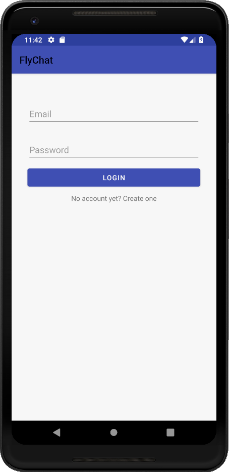
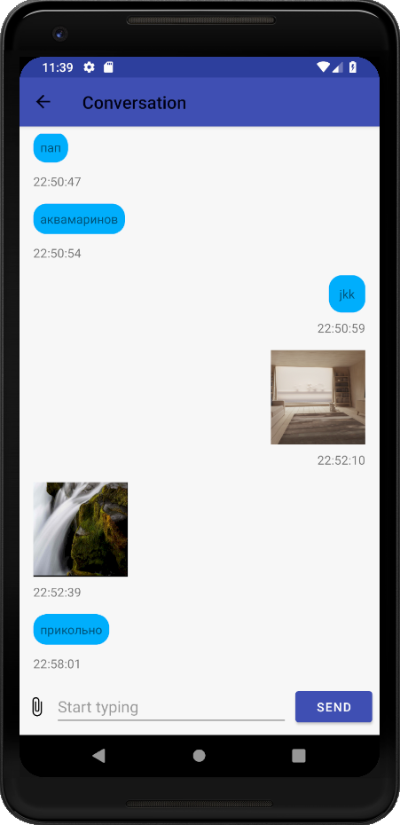

FlyChat (android)
=================

A messaging app illustrating Firebase and Android development practices using latest architecture components.

Introduction
------------

Flychat is a real-time messaging application that allows to communicate using text messages, pictures and etc.

Application development language is [Kotlin](https://kotlinlang.org/).

Application is built using MVVM and Observer architecture patterns with help of [Android architecure components](https://developer.android.com/topic/libraries/architecture),
which are a collection of libraries that help design robust, testable, and maintainable apps.

Gettings Started
----------------
This project uses the Gradle build system. To build this project, use the
`gradlew build` command or use "Import Project" in Android Studio.

Screenshots
-----------

Libraries Used
--------------
* [Architecture][1] - A collection of libraries that help design robust, testable, and
  maintainable apps. Starting with classes for managing UI components lifecycle and handling data
  persistence.

* [Lifecycles][2] - Create a UI that automatically responds to lifecycle events.
* [LiveData][3] - Build data objects that notify views when the underlying database changes.
* [Navigation][4] - Handle everything needed for in-app navigation.
* [ViewModel][5] - Store UI-related data that isn't destroyed on app rotations.
     asynchronous tasks for optimal execution.
* [Picasso][6] for image loading.
* [Firebase Realtime Database][7] as a database.

[1]: https://developer.android.com/jetpack/arch/
[2]: https://developer.android.com/topic/libraries/architecture/lifecycle
[3]: https://developer.android.com/topic/libraries/architecture/livedata
[4]: https://developer.android.com/topic/libraries/architecture/navigation/
[5]: https://developer.android.com/topic/libraries/architecture/viewmodel
[6]: https://github.com/square/picasso
[7]: https://firebase.google.com/products/realtime-database/

Upcoming features
-----------------
Updates will include bug fixes, further optimizations and additional functionality, also supporting latest Android version.

Development Requirements
------------------------
For development, the latest version of Android Studio 3.4 is required. The latest version can be
downloaded from [here](https://developer.android.com/studio/).

IOS
---
Check out my colleagues' project [here](https://github.com/kazakvadim/PhotoMap).

